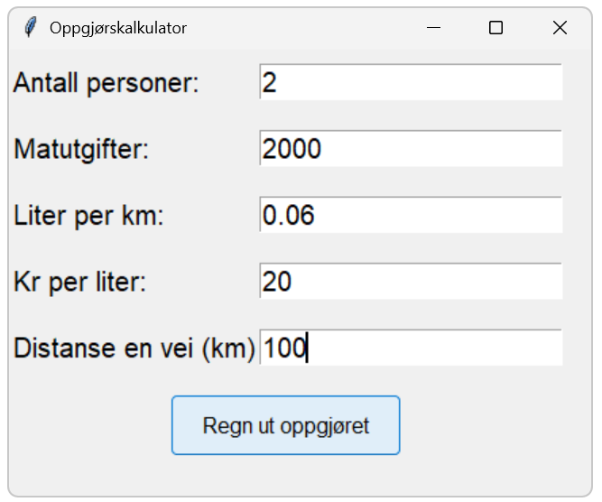
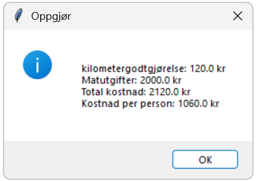

# Oppgjorskalkulator
A simple Python project to calculate settlements after driving and shopping expenses.

## Screenshots



## Installation
1. Clone the repository
```bash
git clone https://github.com/Stianao/Oppgjorskalkulator.git
```
2. Open project in Visual Studio Code
3. Run 

## Features
- Calculates the total settlement cost
- Popup window with inputfields
- Popup window to show the total costs